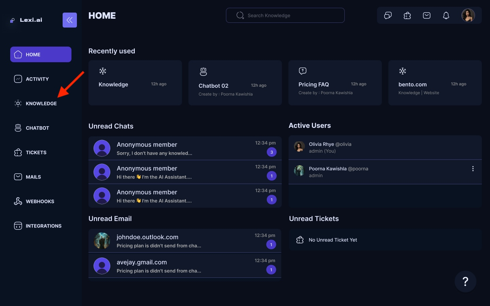

## Adding Knowledge

You can add your custom knowledge to the chatbot for more personalized and accurate resolutions.

- On your LEXI Home screen, Navigate to **Sources** under the **Knowledge Base** section.

<Frame>
  
</Frame>

- You can add your knowledge files by clicking the **Add a new knowledge**.