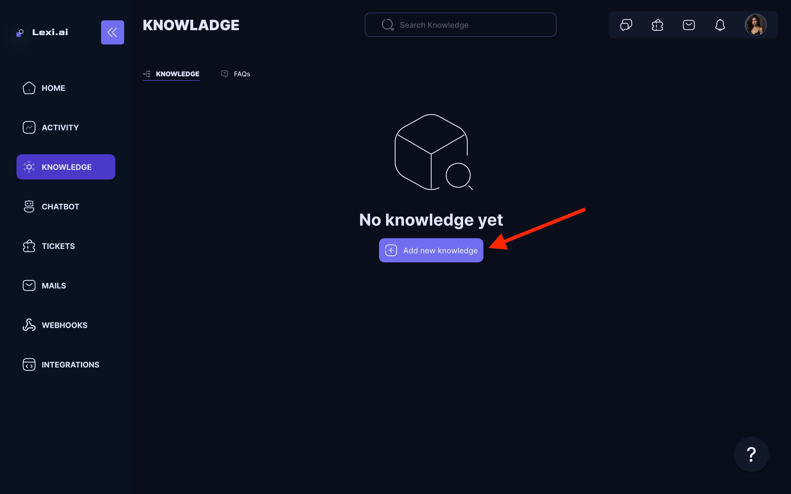
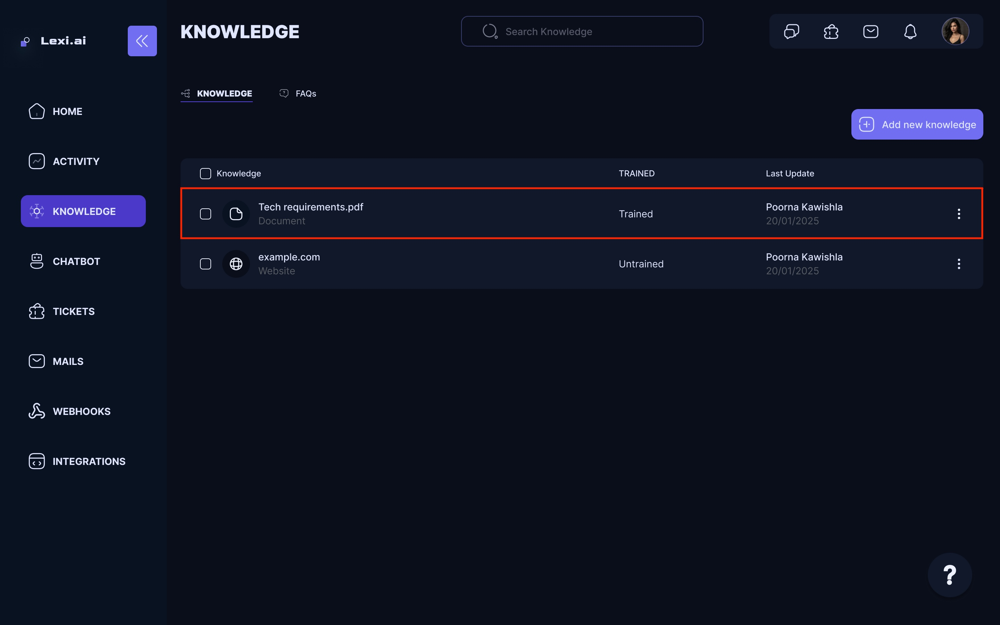
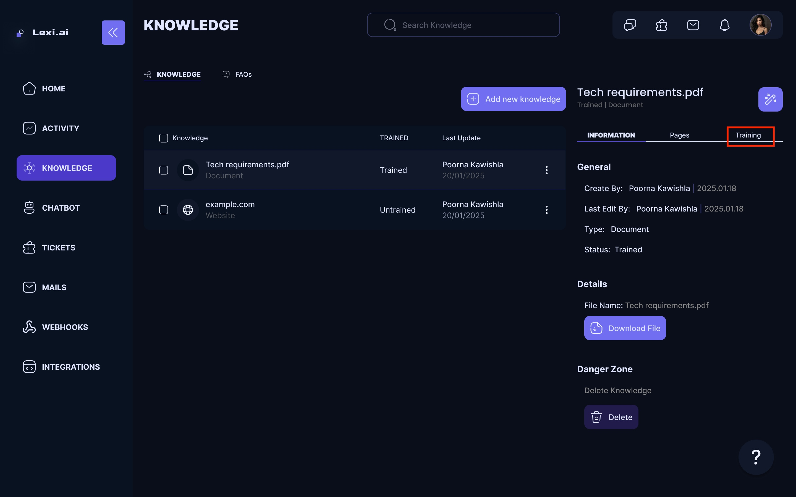
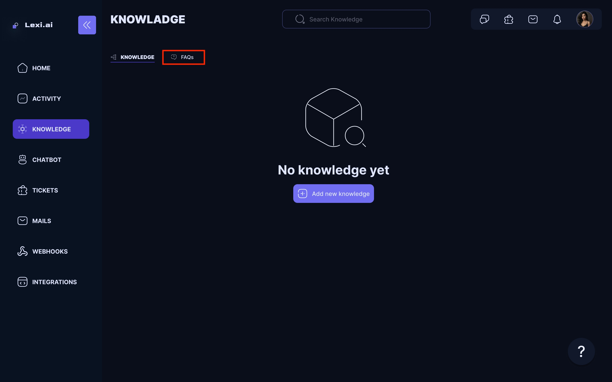
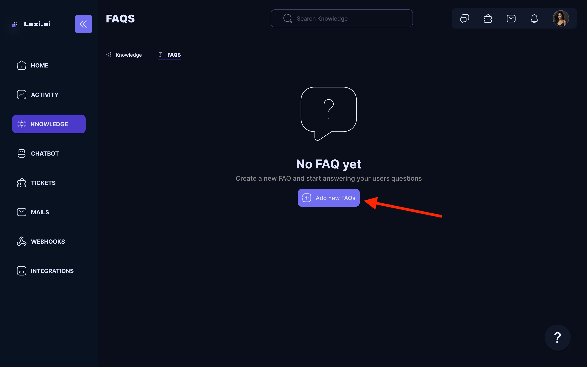
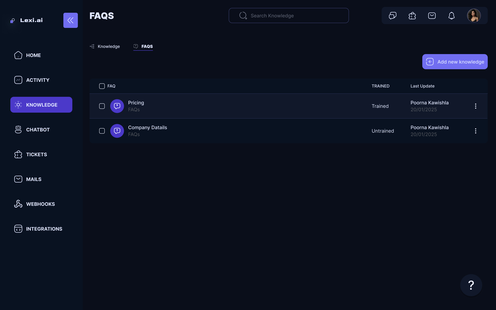
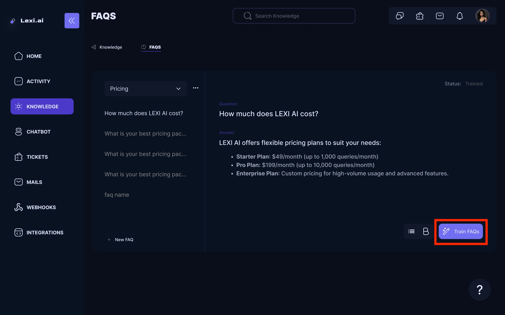

## Adding Knowledge

You can add your custom knowledge to the chatbot for more personalized and accurate resolutions.

- On your LEXI Home screen, Navigate to **Sources** under the **Knowledge Base** section.

<Frame>
  
</Frame>

- You can add your knowledge files by clicking the **Add a new knowledge**.

<Frame>
  
</Frame>

- Choose your Knowledge source type from the dropdown list. You can choose from the following options:

  - **Website**: You can share the link to your website or guide page. LEXI AI will extract the information from the web link provided and train the chatbot for future use..
  - **Document**: You can upload documents in any format. LEXI AI will extract text from them and add them to its knowledge base..

<Frame>
  
</Frame>

- Add the knowledge; here, we are choosing PDF files as the knowledge type.
<Frame>
  
</Frame>

- Once you have added the document or website , go to the left side of the screen and train the AI Model.

<Frame>
  
</Frame>

- Click on the **Train** button to train the AI model with the new knowledge. This will take a few minutes, depending on the size of the document or website.
<Frame>
  
</Frame>

## Adding FAQs

People usually come up with frequently asked questions, so why not add FAQs directly on your chatbot beforehand?

<Note>An FAQ is a special kind of knowledge.
It is a collection of questions and answers and it is the most "direct" form of knowledge that you can provide to the AI. When an FAQ is find as a potential answer to a user's question, this knowledge is prioritized over other sources.</Note>

Let's see how you can add FAQs to your chatbot:

- On your LEXI Home screen, Navigate to  **FAQs** under the **Knowledge Base** section.

<Frame>
  
</Frame>

- Click on Create a new FAQ
<Frame>
  
</Frame>

- You can create the category name based on your needs.
<Frame>
  
</Frame>

- Example of FAQs category name:
<Frame>
  
</Frame>

- Once you have added all your Q&As, training the chatbot is time.
- Return to the FAQ page and click Train AI model to train the chatbot under the Training tab.

<Frame>
  
</Frame>

<Check>That's it! You have now successfully added and trained your knowledge sources and FAQs 🥳</Check>