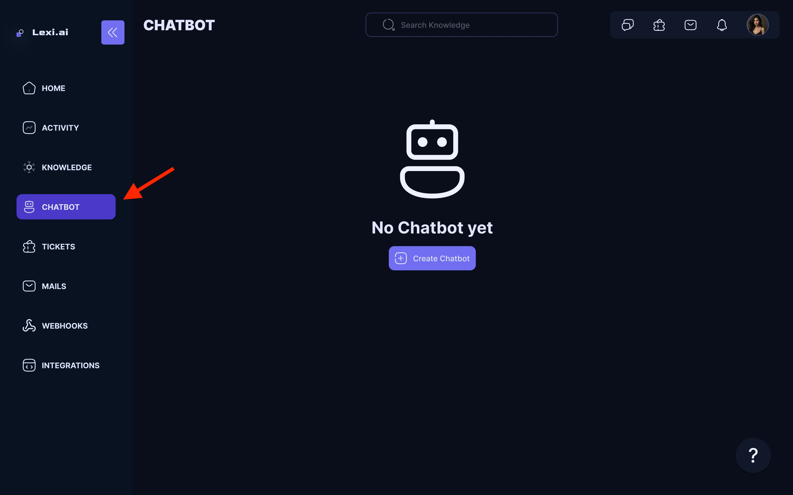
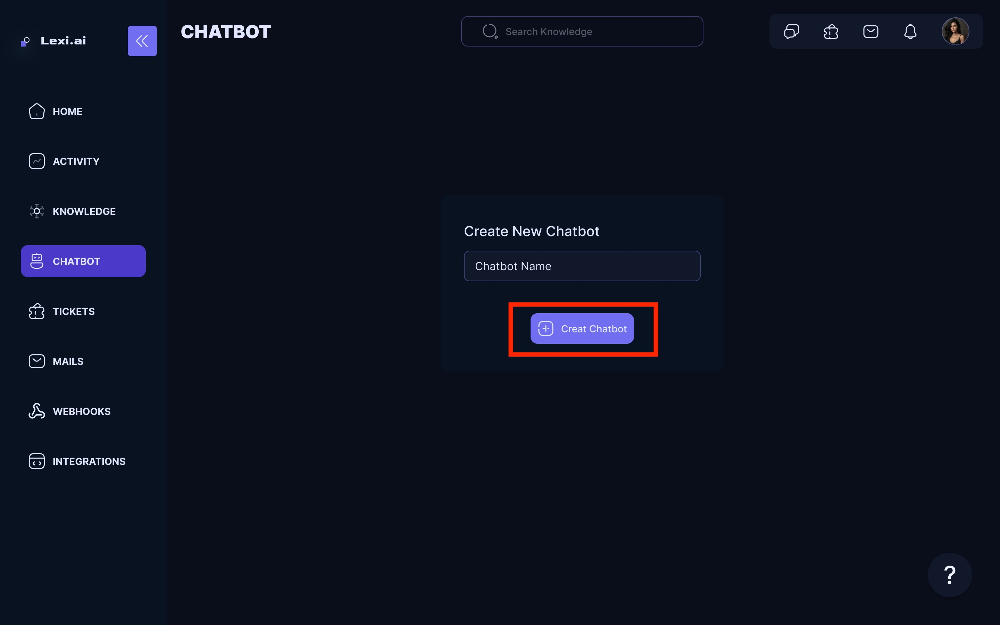
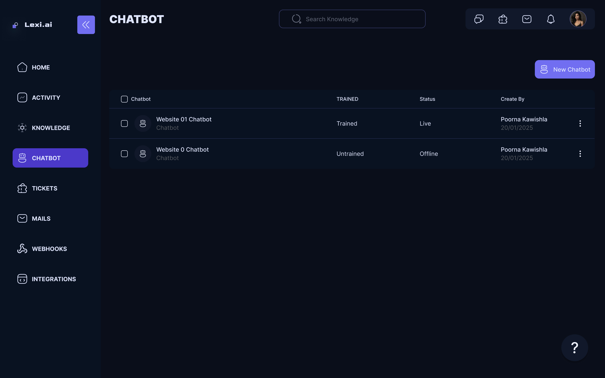
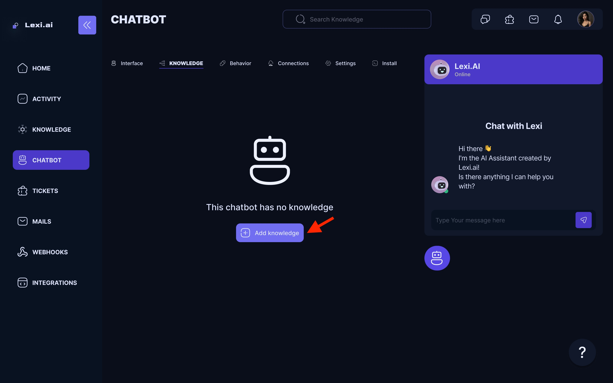
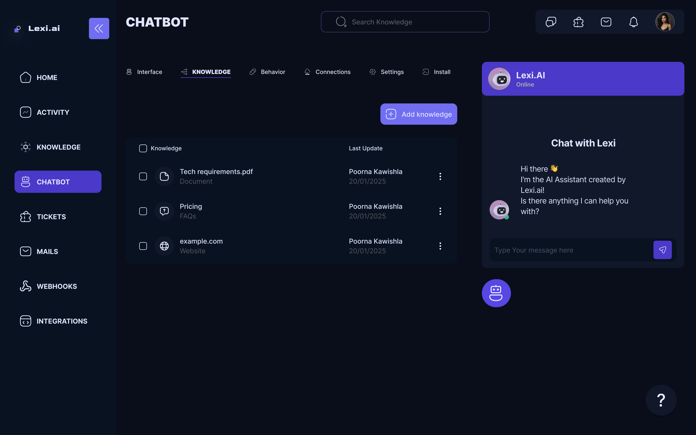

## Create an AI chatbot

Creating your first AI Chatbot is easy. Here are the baby steps you need to follow.

- Navigate to chatbots on your Dashboard Screen.

<Frame>
  
</Frame>

- Click on Create a new chatbot.

<Frame>
  
</Frame>

- Sample Chatbots 

<Frame>
  
</Frame>

## Appearance and basic settings

- You can always change the way your chatbot looks and behaves.
- You can view your chatbot's appearance options and basic settings under the Chatbot tab.
- Appearance & Basic Settings has options like Headline, Description, Welcome message, and Brand color to edit

<Frame>
  
</Frame>

## Adding Knowledge to your chatbot

By default, a newly created chatbot does not have any knowledge.
So in order to make your chatbot smart, we need to teach it first.

Start by adding the knowledge sources you need.
You can use a website, YouTube video, documents, or custom FAQs as knowledge sources.

Once you have added and trained your knowledge, you can add it to your chatbot:
- Select the chatbot to which you want to add knowledge.
- Go to the chatbot configuration page by clicking on the chatbot name.

<Frame>
  
</Frame>

- A pop-up will appear showing all the knowledge base you have created so far from which to choose.
- Select the knowledge you want to add for this particular chatbot and click on add knowledge.

<Frame>
  
</Frame>

<Check>Woah! You just added a knowledge source to your chatbot 🥳</Check>