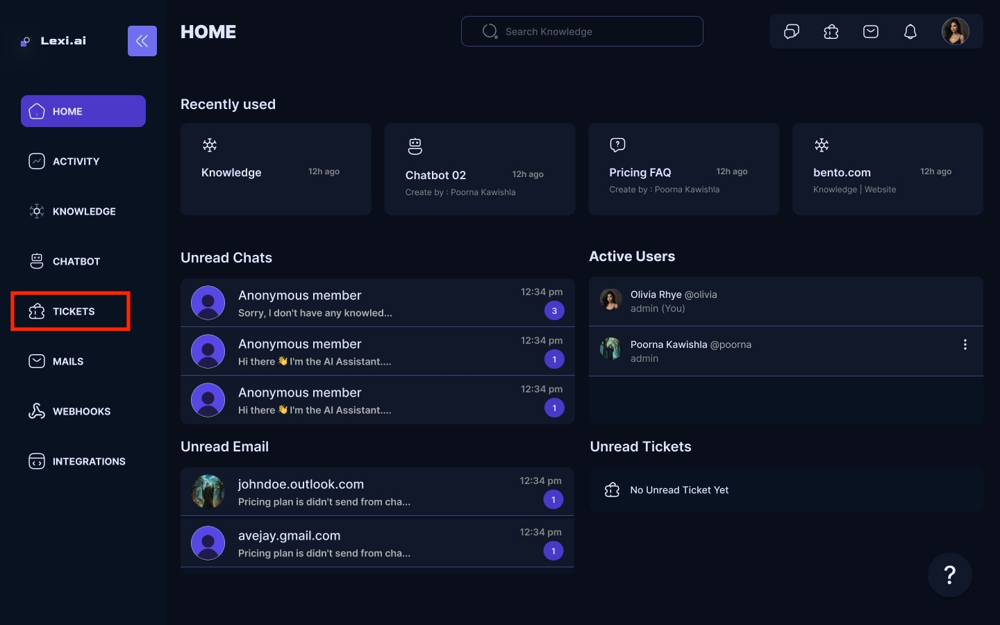
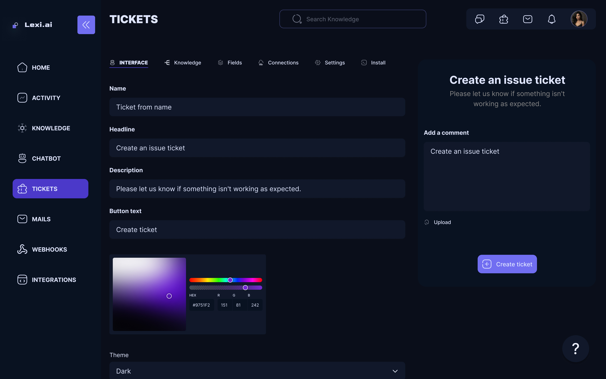
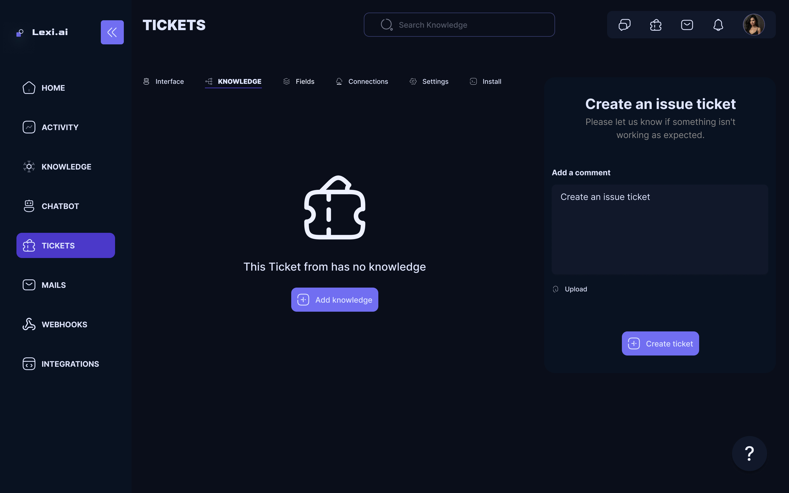
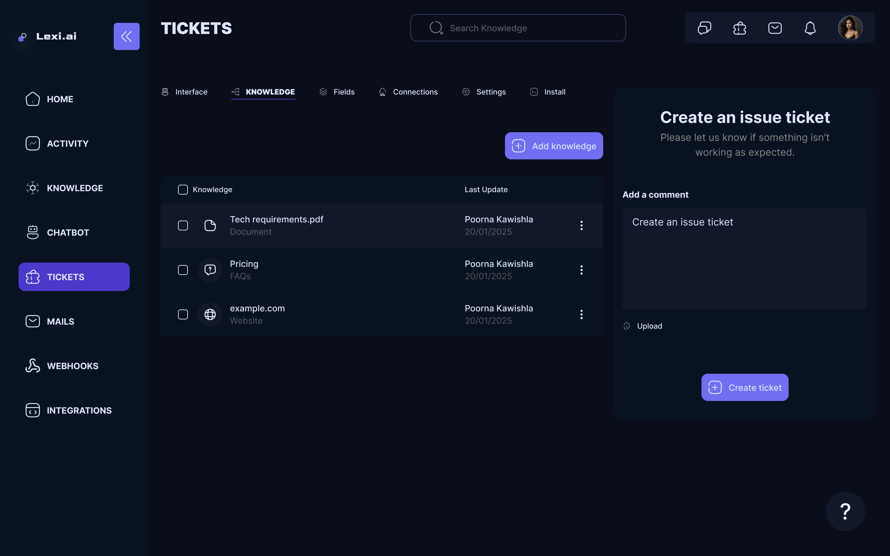

## Create a New Ticket Form

To connect a ticket form with your AI Chatbot, you first need to create one

- Navigate to Ticket Forms for your Home screen.

<Frame>
  
</Frame>

- Click on Create New Ticket Form.

<Frame>
  
</Frame>

- A new Untitled Ticket form will be created. Click on it to be directed to the configuration page of the selected ticket form.
- Use this page to configure your Ticket form. Options such as the Ticket form name, Headline, Descriptions, Button, and many more are available.
- Once you are done configuring the custom ticket form, it will be automatically saved.

<Frame>
  
</Frame>

## How to Connect Ticket Form to Chatbot
- Select the chatbot to which you want to add a Ticket form connection.
- On the configuration page of the chatbot, head over to the Connections tab.
- Click on Add Ticket Form under the Connections Tab.

<Frame>
  
</Frame>

<Frame>
  
</Frame>

<Check>Congrats! Your newly created Ticket Form is connected to the chatbot. 🥳</Check>